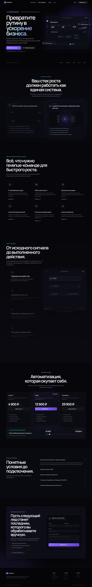
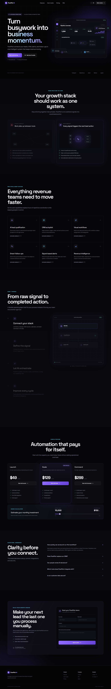

# FlowPilot AI


FlowPilot AI is a fictional revenue-automation SaaS landing page built as a portfolio case study. It demonstrates conversion-focused layout, controlled GSAP motion, interactive pricing, accessible content, and validated lead capture without claiming a real SaaS backend.

## Live Demo

https://animated-saas-landing-tau.vercel.app

## Source Code

https://github.com/Andrey15211/animated-saas-landing

## Features

- Responsive product landing page with a code-built dashboard visual
- GSAP hero, feature, status-card, and scroll timeline animations
- Interactive pricing tiers and lead-volume calculator
- Accessible FAQ accordion
- React Hook Form and Zod lead-form validation
- Reduced-motion behavior for continuous and scroll-driven animation

## Tech Stack

- Next.js 16 App Router
- React 19
- TypeScript
- Tailwind CSS
- GSAP and ScrollTrigger
- React Hook Form and Zod
- next-intl
- Vitest

## Localization

- RU/EN support: complete interface and validation localization
- Default language: Russian (`/ru`)
- Language switcher: available in the header
- English route: `/en`

## Screenshots

### Desktop



### Mobile

Planned path: `docs/screenshots/mobile.png`

### RU/EN example



Mobile screenshot will be added after final device-width capture.

## Local Development

```bash
npm install
npm run dev
npm run build
```

Open `http://localhost:3000/ru`.

## Deployment

Deployed on Vercel with the standard Next.js preset. No environment variables are required; the form currently simulates a successful client-side submission.

## What this project demonstrates

- Animation and creative frontend engineering
- Commercial SaaS landing-page structure
- Accessible motion and reduced-motion handling
- Localized form validation
- Responsive product storytelling

## Recommended GitHub Topics

`saas-landing-page` `nextjs` `react` `typescript` `gsap` `scrolltrigger` `tailwindcss` `next-intl` `frontend-animation` `vercel`
